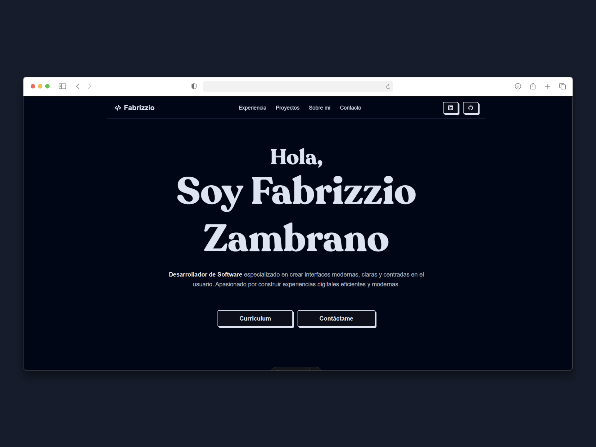

# 🌐 Portafolio Personal - Fabrizzio Zambrano
 
Este proyecto está diseñado para demostrar mis **habilidades y proyectos como Desarrollador de Software**, utilizando tecnologías modernas para ofrecer una experiencia visual atractiva y optimizada.

## 🖼 **Preview**

  


---

## 🚀 **Tech Stack**
- **[Astro](https://astro.build/)** - Framework estático rápido y flexible.
- **[React](https://react.dev/)** - Componentes interactivos y reutilizables.
- **[Tailwind CSS](https://tailwindcss.com/)** - Estilos utilitarios con un diseño **Neobrutalism**.
- **[shadcn/ui](https://ui.shadcn.com/)** - Componentes accesibles y personalizables.
- **[GSAP](https://gsap.com/)** - Animaciones dinámicas y suaves para el **Hero**.
- **[Vercel](https://vercel.com/)** - Despliegue rápido y confiable.


---

## 📂 **Secciones Principales**
1. **Hero** - Presentación principal con animación GSAP.  
2. **Experiencia** - Línea de tiempo con mis experiencias laborales.  
3. **Proyectos** - Galería con mis proyectos destacados.  
4. **Sobre Mí** - Una breve introducción profesional.  
5. **Contacto** - Formas de contacto y enlaces a redes sociales.

---

## 🌎 **Deploy**
El portafolio está desplegado en **Vercel**:  
[🔗 Visitar el Portafolio](https://portfolio-fabrizziozambrano.vercel.app)

---

## ⚡ **Instalación y Uso**
Si quieres correr el proyecto localmente:

```bash
# Clonar el repositorio
git clone https://github.com/Fabrizzioxc/portfolioV2.git

# Instalar dependencias
npm install

# Ejecutar en modo desarrollo
npm run dev
